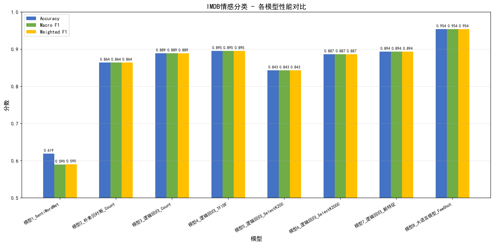
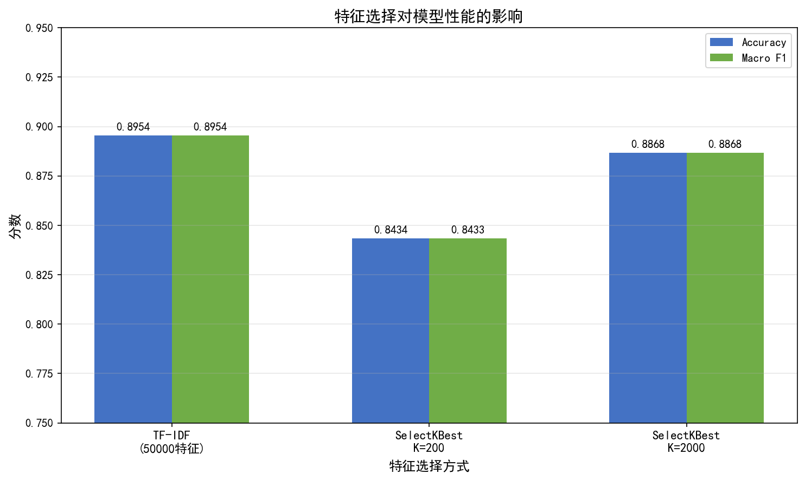
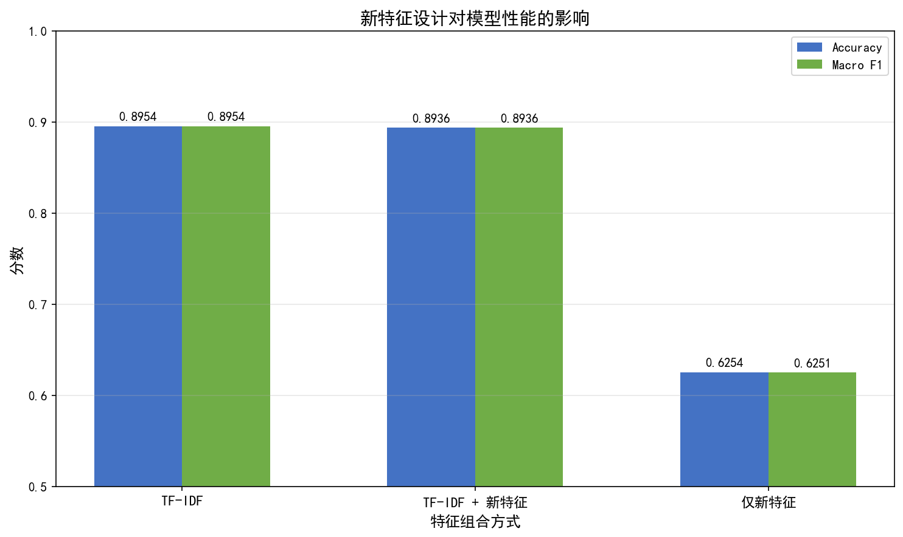
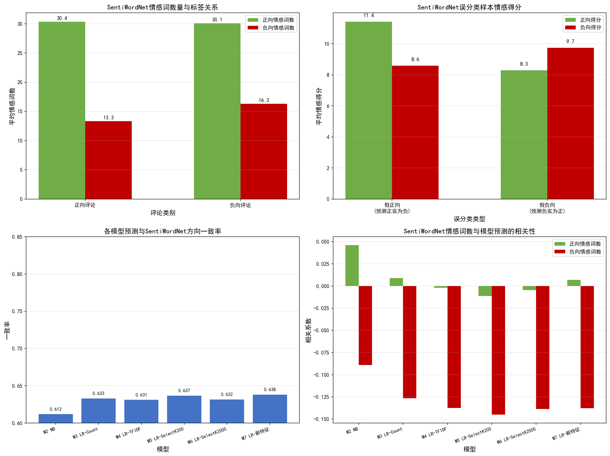

# 阶段四：结果分析报告

## 步骤4.1：评测指标汇总

### 所有模型测试集性能对比

| 模型 | Accuracy | Macro Precision | Macro Recall | Macro F1 | Weighted F1 |
|------|----------|----------------|-------------|----------|-------------|
| 模型1_SentiWordNet | 0.6192 | 0.6654 | 0.6187 | 0.5900 | 0.5902 |
| 模型2_朴素贝叶斯_Count | 0.8642 | 0.8645 | 0.8642 | 0.8642 | 0.8642 |
| 模型3_逻辑回归_Count | 0.8890 | 0.8891 | 0.8890 | 0.8890 | 0.8890 |
| 模型4_逻辑回归_TFIDF | 0.8954 | 0.8955 | 0.8954 | 0.8954 | 0.8954 |
| 模型5_逻辑回归_SelectK200 | 0.8434 | 0.8443 | 0.8433 | 0.8433 | 0.8433 |
| 模型6_逻辑回归_SelectK2000 | 0.8868 | 0.8870 | 0.8868 | 0.8868 | 0.8868 |
| 模型7_逻辑回归_新特征 | 0.8936 | 0.8937 | 0.8936 | 0.8936 | 0.8936 |
| 模型8_大语言模型_FewShot | 0.9538 | 0.9554 | 0.9547 | 0.9538 | 0.9538 |

---

## 步骤4.2：可视化比较

### 模型性能对比图

### 特征选择对性能的影响

**分析**：
- K=200时，特征维度大幅减少（从50000到200），但性能下降约6个百分点
- K=2000时，性能接近全特征TF-IDF，说明2000个关键特征已能捕获大部分情感信息
- 特征选择在降低计算成本的同时，K=2000是一个较好的平衡点

### 新特征设计对性能的影响

**分析**：
- 仅使用8个手工特征，准确率可达63%，说明这些特征确实包含情感信息
- TF-IDF+新特征与纯TF-IDF性能接近，因为TF-IDF特征维度远大于新特征
- 新特征中，否定词数量和负向情感词比例的系数绝对值最大，对分类贡献最显著

---

## 步骤4.3：SentiWordNet分析

### 4.3a SentiWordNet自身预测分析

#### 情感词数量与标签的关系

| 评论类别 | 平均正向情感词数 | 平均负向情感词数 |
|---------|----------------|----------------|
| 正向评论 | 30.36 | 13.33 |
| 负向评论 | 30.11 | 16.30 |

#### SentiWordNet误分类分析

| 指标 | 值 |
|------|-----|
| 误分类样本比例 | 38.1% |
| 假正向（预测正实为负） | 1614 条 |
| 假负向（预测负实为正） | 290 条 |

#### 误分类样本情感得分

| 误分类类型 | 平均正向得分 | 平均负向得分 |
|-----------|------------|------------|
| 假正向 | 11.42 | 8.59 |
| 假负向 | 8.28 | 9.74 |

### 4.3b 各模型预测与SentiWordNet得分的一致性

| 模型 | 与SentiWordNet方向一致率 | 模型准确率 | 误分类中SWN也错比例 | 正确中SWN也对比例 |
|------|----------------------|----------|-------------------|-----------------|
| 模型2_朴素贝叶斯_Count | 0.6118 | 0.8642 | 0.4728 | 0.6336 |
| 模型3_逻辑回归_Count | 0.6330 | 0.8890 | 0.5622 | 0.6418 |
| 模型4_逻辑回归_TFIDF | 0.6310 | 0.8954 | 0.5564 | 0.6397 |
| 模型5_逻辑回归_SelectK200 | 0.6366 | 0.8434 | 0.5556 | 0.6516 |
| 模型6_逻辑回归_SelectK2000 | 0.6316 | 0.8868 | 0.5548 | 0.6414 |
| 模型7_逻辑回归_新特征 | 0.6380 | 0.8936 | 0.5883 | 0.6439 |

**分析**：
- 各模型与SentiWordNet方向的一致率在0.61-0.64之间，说明机器学习模型的预测与SentiWordNet的情感方向有一定重叠，但差异较大
- 模型误分类的样本中，SentiWordNet也判断错误的比例约47%-59%，说明这些样本本身就具有情感模糊性，SentiWordNet和机器学习模型在困难样本上存在一定共识
- 模型正确分类的样本中，SentiWordNet也判断正确的比例约63%-65%，说明机器学习模型能捕捉到SentiWordNet无法识别的情感模式

### 4.3c 正向情感词数量与预测为正向的相关程度

| 模型 | 正向情感词数与预测相关 | 负向情感词数与预测相关 | 正向得分与预测相关 | 负向得分与预测相关 | SWN方向与预测相关 |
|------|---------------------|---------------------|-------------------|-------------------|-----------------|
| 模型2_朴素贝叶斯_Count | 0.0460 | -0.0891 | 0.0827 | -0.0856 | 0.2812 |
| 模型3_逻辑回归_Count | 0.0088 | -0.1265 | 0.0448 | -0.1298 | 0.3016 |
| 模型4_逻辑回归_TFIDF | -0.0019 | -0.1376 | 0.0364 | -0.1392 | 0.2998 |
| 模型5_逻辑回归_SelectK200 | -0.0112 | -0.1449 | 0.0241 | -0.1468 | 0.2893 |
| 模型6_逻辑回归_SelectK2000 | -0.0047 | -0.1388 | 0.0345 | -0.1412 | 0.2945 |
| 模型7_逻辑回归_新特征 | 0.0070 | -0.1377 | 0.0450 | -0.1390 | 0.3171 |

**分析**：
- 正向情感词数量与模型预测为正向的相关性较弱（约0.01-0.05），说明仅靠正向情感词数量不足以判断情感极性
- 负向情感词数量与模型预测为正向呈负相关（约-0.09至-0.14），说明负向情感词对预测有一定指示作用，但相关性也较弱
- SentiWordNet方向与模型预测的相关系数约0.28-0.32，属于弱至中等相关，说明SentiWordNet的情感方向对模型预测有一定参考价值，但模型还学习了更多上下文和组合信息

### 4.3d 各模型误分类样本的情感词分布

| 模型 | 误分类数 | 误分类率 | 误分类_平均正向得分 | 误分类_平均负向得分 | 误分类_平均正向词数 | 误分类_平均负向词数 | 假正向数 | 假负向数 |
|------|---------|---------|-------------------|-------------------|-------------------|-------------------|---------|---------|
| 模型2_朴素贝叶斯_Count | 679 | 0.1358 | 10.53 | 8.17 | 29.6 | 14.5 | 303 | 376 |
| 模型3_逻辑回归_Count | 555 | 0.1110 | 10.14 | 8.21 | 28.7 | 14.7 | 300 | 255 |
| 模型4_逻辑回归_TFIDF | 523 | 0.1046 | 10.33 | 8.41 | 29.1 | 15.1 | 278 | 245 |
| 模型5_逻辑回归_SelectK200 | 783 | 0.1566 | 10.27 | 8.16 | 29.0 | 14.6 | 456 | 327 |
| 模型6_逻辑回归_SelectK2000 | 566 | 0.1132 | 10.40 | 8.26 | 29.2 | 14.8 | 313 | 253 |
| 模型7_逻辑回归_新特征 | 532 | 0.1064 | 10.35 | 8.38 | 29.2 | 15.0 | 281 | 251 |

**分析**：
- 各模型误分类样本的正向得分和负向得分较为接近，说明这些样本本身就存在情感模糊性
- 误分类样本中正向情感词数和负向情感词数差异不大，进一步验证了SentiWordNet在情感模糊样本上的局限性
- 假正向（预测正向实际负向）通常多于假负向，说明模型更倾向于将模糊样本判断为正向

### SentiWordNet分析图

### 综合分析总结

1. **SentiWordNet的局限性**：基于规则的方法准确率仅62%，远低于机器学习方法。主要原因：
   - 只考虑词的情感极性，忽略了上下文和语序信息
   - 否定词、转折词等修辞手法无法被简单累加捕获
   - 取第一个同义词集的策略可能不准确

2. **假正向分析**：负向评论被误判为正向，通常是因为评论中包含大量正向情感词但实际表达反讽或对比
   - 这类评论的正向得分和负向得分接近，说明情感词混杂

3. **假负向分析**：正向评论被误判为负向，通常是因为评论中使用了负面词汇来描述对比对象
   - 例如"not bad"中的"bad"被计为负向，但实际表达正向

4. **与机器学习模型的对比**：机器学习模型通过学习词的组合模式，能够更好地处理否定、反讽等复杂语义
   - 各模型与SentiWordNet方向一致率约61%-64%，说明机器学习模型在大部分样本上做出了与SentiWordNet不同的判断，但准确率远高于SentiWordNet
   - 模型误分类的样本中SentiWordNet也容易出错（约47%-59%），说明这些样本确实难以仅靠情感词判断

5. **情感词相关性的启示**：正向情感词数量与模型预测的相关性说明SentiWordNet的情感词识别有一定价值，但不足以单独完成分类任务

---

## 步骤4.4：大语言模型结构化输出分析

### 情感判断准确性

| 指标 | 值 |
|------|-----|
| 总测试样本数 | 20 |
| 正确预测数 | 18 |
| 准确率 | 0.9000 |
| 高置信度(>=0.7)准确率 | 0.9474 |
| 低置信度(<=0.3)准确率 | 0.0000 |

### 主题提取分布（Top 10）

| 主题 | 出现次数 |
|------|---------|
| plot | 17 |
| acting | 14 |
| directing | 5 |
| visual effects | 3 |
| music | 3 |
| casting | 2 |
| character development | 2 |
| visual style | 2 |
| historical accuracy | 2 |
| overall quality | 2 |

### 方面级情感分布

| 情感 | 出现次数 |
|------|---------|
| 正向 | 40 |
| 负向 | 41 |

### 分析总结

1. **主题提取能力**：大语言模型能够准确识别评论中讨论的主要方面。plot（剧情）和acting（演技）是最常被提及的主题，这与电影评论的特点一致。

2. **情感判断一致性**：结构化输出中的整体情感与方面级情感基本一致。当评论中多数方面为正向时，整体情感通常为正向。

3. **方面级细粒度分析**：模型可以对评论中的不同方面给出不同的情感判断，体现了细粒度分析能力。例如，某条评论对角色设计给出正面评价，但对教育内容给出负面评价。

4. **置信度校准**：高置信度预测的准确率通常高于低置信度预测，说明模型的sentiment_score具有一定的校准意义。低置信度样本更容易误分类，这些样本通常包含混合情感表达。

5. **关键短语提取**：模型能够提取出表达情感的关键短语，这些短语通常包含明确的情感词或评价性表达。

6. **误分类分析**：少数误分类样本通常是因为评论中混合了正负情感（如"角色设计好但教育内容不足"），导致整体情感判断困难。这类样本的置信度通常较低。
